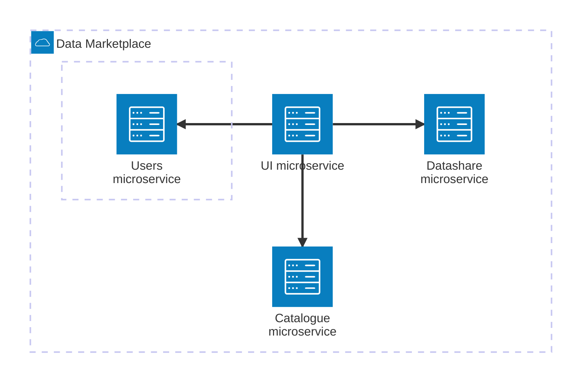
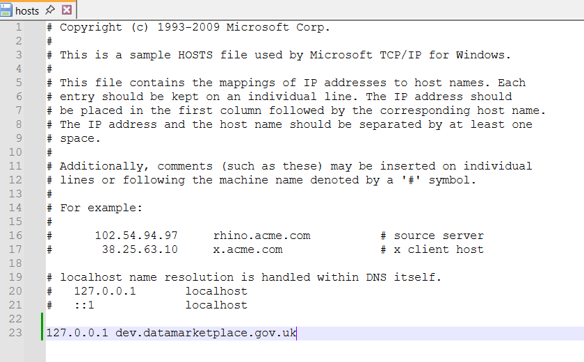
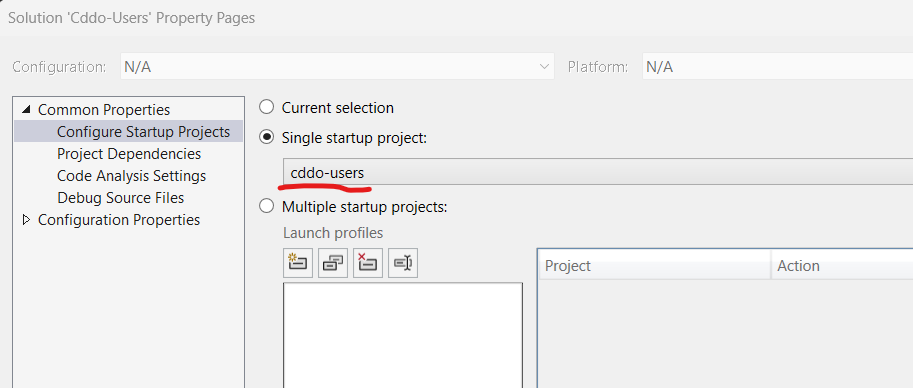
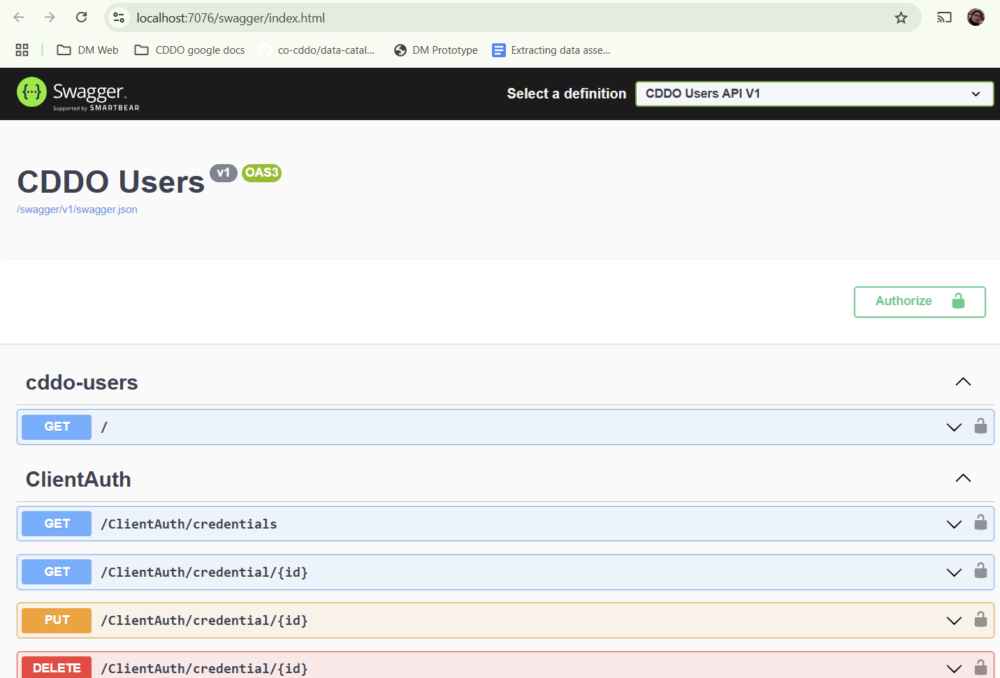

# CDDO Data Marketplace - Users API

<!-- [](https://TBC)


[](http://choosealicense.com/licenses/mit/) -->

## Contribution Guidelines

The contribution guidelines are as per the guide [HERE](./readme/CONTRIBUTING.md). Please read before continuing with your development setup.

## Description

The CDDO Data Marketplace is a website service which enables the cataloguing of data assets owned by governnent organisations, the search and discovery of data assets by users trying to find data, and the management of requests for data assets.

CDDO Data Marketplace implments the [Data Catalogue Metadata](https://github.com/co-cddo/data-catalogue-metadata) profile as its underlying data asset model, and has a dependency on the [GOV.UK Single Sign On](https://sso.service.security.gov.uk/) service to manage authentication.

The Data Marketplace solution is split between the following repositories:

- [cddo.ui](https://github.com/co-cddo/data-marketplace-beta), which contains:
  - UI microservice
  - Catalogue microservice
- [cddo.users](https://github.com/co-cddo/data-marketplace-beta-users), which contains:
  - Users microservice
- [cddo.datashare](https://github.com/co-cddo/data-marketplace-beta-datashare) which contains:
  - Datashare microservice

The Data Marketplace has the following runtime architecture:



## Local development environment setup

This section contains instructions which should only have to be performed once, ever. 

### IDE setup 

Although you can use a different IDE, we recommend installing the latest version of [Microsoft Visual Studio Community Edition](https://visualstudio.microsoft.com/vs/community/) to run the solution.  

Once you have installed Visual Studio, add a package source in the NuGet Package Manager pointing to the following URL:

    https://pkgs.dev.azure.com/agrimetrics-projects/_packaging/agm-intellectual-property%40Local/nuget/v3/index.json

 

Next, open the Exception Settings window (Debug -> Windows -> Exception Settings) and select the checkbox labeled "Common Language Runtime Exceptions". 

 

### Local machine set up

Configure a local certificate to manage redirects from UK Government Security. To do this, run the following command from Powershell:

``` sh
$cert = New-SelfSignedCertificate -DnsName "dev.datamarketplace.gov.uk" -CertStoreLocation "cert:\LocalMachine\My" -KeyUsage DigitalSignature -KeyExportPolicy Exportable -NotAfter (Get-Date).AddYears(1)
$pwd = ConvertTo-SecureString -String "<strong-password>" -Force -AsPlainText
Export-PfxCertificate -Cert $cert -FilePath "C:\Users\<username>\Documents\dev-cddo.pfx" -Password $pwd
```

Next, open your hosts file (usually found in the folder `C:\Windows\System32\drivers\etc`) and add the following line to the bottom of it:

    127.0.0.1 dev.datamarketplace.gov.uk

 

## Users API configuration  

This section contains instructions on configuring the `Cddo-Users` solution so that it can be run locally. 

This section assumes you have completed all the steps in *Local development environment setup*.

### Local settings

Take a copy of the file [here](./cddo-users/appsettings.json) and rename it to `../cddo-users/appsettings.Development.json`.

Open the file and update any of the placeholder values to their actual runtime values. 

Next, set the following projects to start with the debug target of "http" (right click solution -> Configure Startup Projects):

- cddo-users



## Running the solution in your local development environment

Now run the solution!

Assuming there are no errors on startup, you should be able to see the swagger page for the API on local port 7076.




